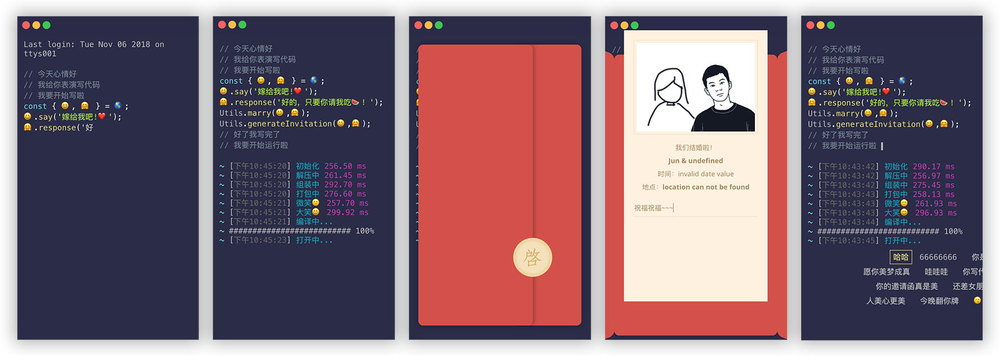

# 婚礼邀请函
打开邀请函之后，会先模拟编写一段代码，编写完成之后会模拟执行，成功后则打开邀请函。在邀请函内可以填写祝福语并发送，发送成功后关闭邀请函，显示弹幕。



## 开发
### 前提条件
需要安装 Node.js 环境。

clone 到本地之后，先安装所有依赖。
```
npm install
```

再打开开发模式，实时调试。
```
npm run serve
```

## 构建
构建生产版本/上线。
```
npm run build
```

## 测试
```
npm run test
```

## Lints and fixes files
```
npm run lint
```
